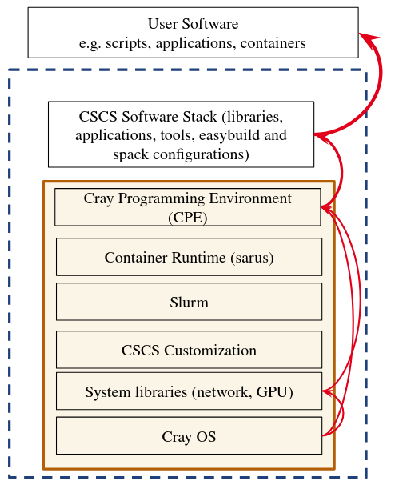
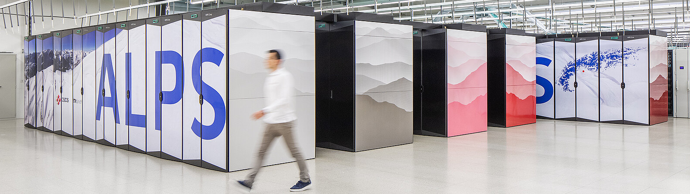
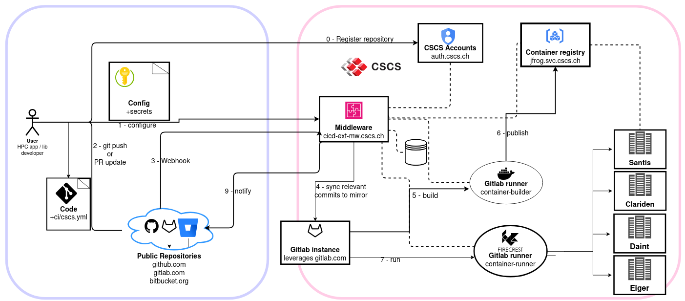

# Modern Software Deployment at CSCS
<br>

**How we learnt to relax and give users what they want.**

Ben Cumming @ HPC Advisery 2025

---

# Who Am I

I have been at CSCS for 12 years:

* spent the first 8 as a scientific software developer and benchmarker
    * effectively a glorified user
* my favourite complaints included:
    * why do people think Python is easy?
    * how hard can it be to provide working software on our clusters?
* we had a big reorg at CSCS
    * all of the people who were responsible for software were looking for other roles... for some reason

So I took responsibility for software deployment
* and have been finding out how hard it is to provide HPC software

Luckily we have a fantastic group of people to support me - the trick is to give them the tools they need!

---
layout: two-cols
layoutClass: gap-2
---

# Software before Alps

The software environment based on vendor-provided software stack

* The Cray Programming Environment (CPE) installed in the base OS image
* CPE is released every 6 months
* CSCS and user software installations were based on
* Upgrading CPE implied rebuilding CSCS-provided and user-installed software

::right::

<div class="flex justify-right">
    
</div>

---

# Case study: C2SM

The Center for Climate Systems Modeling (C2SM) at ETHZ are a key user
* Key use case: climate simulation using COSMO and ICON
* Complicated Fortran codebases that are very sensitive to changes in dependencies

To upgrade the system:
```
do {
    install / configure a new version of CPE on a TDS system
    CSCS update recipes for our software stack and build on a shared file system
    C2SM access the system to build and test their software
} while (there are problems);
update Daint
```

Frequently we were unable to resolve issues and had to wait for another update
* everybody upgrades, or nobody upgrades
* every upgrade has knock on effects for every user

---
layout: two-cols
layoutClass: gap-2
---

# The winds of change: Alps

Alps is a HPE Cray EX system with ~4000 nodes.

**key changes**:
* Partitioned into use-case and tennent-specific clusters
* Community of users expanded, bringing new requirements

The ML/AI community can't wait for software upgrades

The climate community can't upgrade their workflow every 2 weeks

Getting a system administrator to build a new image and reboot a cluster to deploy does not scale

::right::

<br>

<div class="flex justify-center">
    
</div>

<br>
<br>

<div class="flex justify-center">
    
</div>

---

# The new HPC provider axioms

HPC Centers provide pre-built software for their users.

Vendors are not capable of delivering stable, up to date, out-of-the box solutions

Scientific projects have 1-3 year duration - once their software is built and working it must continue to work for the project duration.

Other users need to use the latest versions of software

Staff who install software and help users need to have full control over the whole software stack.

Software installation should not require any changes to the running system, or interrupt users.

Rollback of software stacks must be possible

---
layout: two-cols
layoutClass: gap-2
---

# Part 1: independent stacks

HPC centers have to provide software stacks optimised for the target hardware.

We created [Stackinator](https://eth-cscs.github.io/stackinator/)
* software stacks are described in a yaml recipe
* clusters are described in yaml files
* stackinator generates a Makefile the recipe and cluster definition 

Uses Spack with custom packages with Alps-specific optimizations

**the output is a single squashfs file containing the complete software stack**

::right::

```yaml
icon:
  compiler:
      - toolchain: gcc
        spec: gcc
      - toolchain: llvm
        spec: nvhpc
  mpi:
      spec: cray-mpich@8.1.30%nvhpc
      gpu: cuda
  unify: true
  specs:
  - boost ~mpi
  - python@3.10
  - cuda@12.6
  - eccodes@2.36.4%nvhpc +tools +fortran +aec +openmp jp2k=jasper
  - cosmo-eccodes-definitions@2.36.0.3
  - hdf5%nvhpc +szip +hl +fortran +mpi
  - netcdf-c@4.9.2%nvhpc
  - netcdf-cxx4@4.3.1%nvhpc
  - netcdf-fortran@4.6.1%nvhpc
  - openblas
  # for validation
  - cdo
  variants:
  - +mpi
  - +cuda
  - cuda_arch=90
```

---

# Stackinator

---
layout: two-cols
layoutClass: gap-2
---

# Part 2: using stacks

We developed `uenv` -- "the lightest container runtime possible"
* mount the squashfs image at `/user-environment`
* set views = environment variable sets
    * module view: provide modules
    * spack view: spack integration
    * app views: bespoke environments
* manage uenv images in a local repository

Users see a path populated with their software and a change in environment variables

Simple was implemented quickly, just works, and just keeps working

::right::

```console
$ uenv image ls -ahl
uenv                             arch   system  id                size(MB)  date
gromacs/2024:v1                  gh200  daint   b58e6406810279d5   3,658    2024-09-12
julia/24.9:v1                    gh200  daint   7a4269abfdadc046   3,939    2024-11-09
jupyterlab/v4.1.8:v1             gh200  daint   e23aa859dd398637     453    2025-01-10
linalg/24.11:v1                  gh200  daint   e1640cf6aafdca01   4,461    2024-12-03
linaro-forge/23.1.2:v1           gh200  daint   fd67b726a90318d6     341    2024-08-26
namd/3.0:v3                      gh200  daint   49bc65c6905eb5da   4,028    2024-12-12
netcdf-tools/2024:v1             gh200  daint   2a799e99a12b7c13   1,260    2024-09-04
prgenv-gnu/24.11:v1              gh200  daint   b81fd6ba25e88782   4,191    2024-11-27
prgenv-nvfortran/24.11:v2        gh200  daint   d2afc254383cef20   8,703    2025-01-30
pytorch/v2.6.0:1716539422        gh200  daint   1c5e00f7556ad65d   8,124    2025-03-14
specfem3d/4.1.0:1707945673       gh200  daint   c9ad88d01a48a263   3,672    2025-03-10
$ uenv start prgenv-gnu --view=default
$ which nvcc
/user-environment/env/default/bin/nvcc
$ mpicc --version
gcc (Spack GCC) 13.3.0
$ mount | grep /user-environment
$SCRATCH/.uenv-images/images/b8...ac5/store.squashfs
on /user-environment type squashfs
(ro,nosuid,nodev,relatime,errors=continue)
```

---

# Interlude: CI/CD for users


<div class="flex justify-center">
    
</div>

---
layout: two-cols
layoutClass: gap-2
---

# Part 3: deploying stacks

We developed `uenv` -- "the lightest container runtime possible"
* mount the squashfs image at `/user-environment`
* set views = environment variable sets
    * module view: provide modules
    * spack view: spack integration
    * app views: bespoke environments
* manage uenv images in a local repository

Users see a path populated with their software and a change in environment variables

Simple was implemented quickly, just works, and just keeps working

::right::

```console
$ uenv image ls -ahl
uenv                             arch   system  id                size(MB)  date
gromacs/2024:v1                  gh200  daint   b58e6406810279d5   3,658    2024-09-12
julia/24.9:v1                    gh200  daint   7a4269abfdadc046   3,939    2024-11-09
jupyterlab/v4.1.8:v1             gh200  daint   e23aa859dd398637     453    2025-01-10
linalg/24.11:v1                  gh200  daint   e1640cf6aafdca01   4,461    2024-12-03
linaro-forge/23.1.2:v1           gh200  daint   fd67b726a90318d6     341    2024-08-26
namd/3.0:v3                      gh200  daint   49bc65c6905eb5da   4,028    2024-12-12
netcdf-tools/2024:v1             gh200  daint   2a799e99a12b7c13   1,260    2024-09-04
prgenv-gnu/24.11:v1              gh200  daint   b81fd6ba25e88782   4,191    2024-11-27
prgenv-nvfortran/24.11:v2        gh200  daint   d2afc254383cef20   8,703    2025-01-30
pytorch/v2.6.0:1716539422        gh200  daint   1c5e00f7556ad65d   8,124    2025-03-14
specfem3d/4.1.0:1707945673       gh200  daint   c9ad88d01a48a263   3,672    2025-03-10
$ uenv start prgenv-gnu --view=default
$ which nvcc
/user-environment/env/default/bin/nvcc
$ mpicc --version
gcc (Spack GCC) 13.3.0
$ mount | grep /user-environment
$SCRATCH/.uenv-images/images/b8...ac5/store.squashfs
on /user-environment type squashfs
(ro,nosuid,nodev,relatime,errors=continue)
```

